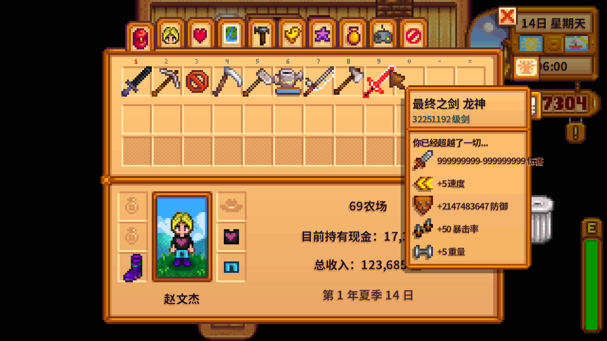

# StardewValley DragonSword Mod

This module added to the game a damage up to 999999999, with full attack range, add 999999999 defense weapon DragonSword.

You can buy it at the Adventurers Guild with a rusty sword and 1634 coins.

Just for fun ~



# Development

First, you should install [.Net SDK](https://dotnet.microsoft.com) (>= 6.0) and install [SMAPI](https://smapi.io/).

Then, clone the repo with your way.

Finally, just open terminal and run below:

```bash
dotnet restore # install dependences
dotnet run # run mod test in game
dotnet build --configuration Release # build mod file
```

You can find mod file in `bin\Release\net6.0\`

[Mod Nexus Page](https://www.nexusmods.com/stardewvalley/mods/24417)